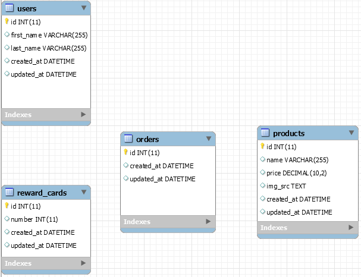
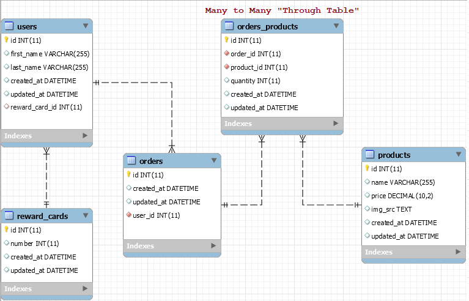
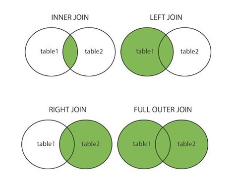
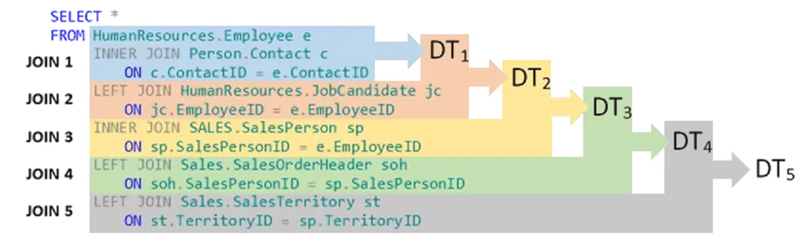

# MySQL Users & Orders Outline

- Create an ERD for `users`, `reward_cards`, `products`, and `orders`.
- Forward engineer the ERD to create the DB.
- Review relationships: 1:1, 1:m, and n:m
- Insert data.
- Query the data with and without joins.

---

## Naming Conventions

- Lowercase, snake case (underscores).
- Tables: plural, Fields: Singular.
- Foreign Key (FK): entity_name_id
- Conventions will change if using an ORM (Object Relational Mapper) where the tables are generated from classes defined in another programming language where you will use that languages naming conventions for classes instead and the ORM may convert the names when generating the DB.

---

## Create Entity Relationship Diagram (ERD) Without Relationships



### Creating an ERD

1. From the home screen, click the icon of tables on the left panel.
2. Click the + at the top.
3. Double click the DB on the left to rename it.
4. To place a table, click the small table icon on the left and then click on the grid. Or press T then click on the grid.
5. Double click on the new table in the grid to rename it and add fields and their data types.
6. Click under column name to add a new field.
7. Every table needs a field named `id` as an `INT` and check: `PK` (Primary Key) `NN` (not null), `AI` (auto increment).
8. Add a `created_at` `DATETIME` field with `Default/Expression` set to `NOW()`.
9. Add an `updated_at` `DATETIME` field with `Default/Expression` set to `NOW() ON UPDATE NOW()`.
10. Add the remaining needed fields.
11. Add other tables and relate them.

---

## Determine The Relationships

1. Can one EntityA be related to many EntityB?
2. Can one EntityB be related to many EntityA?

- Yes to 1 only: it is _1_ EntityA : _Many_ EntityB.
- Yes to 2 only: it is _1_ EntityB : _Many_ EntityA.
- Yes to both: _Many_ EntityA : _Many_ EntityB, a third table will be auto generated to track this because it is essentially two One To _Many_ relationships. Each row in the _Many_ to _Many_ _through_ table will keep track of relating _one_ EntityA to _one_ EntityB by having an id column for each entity to relate one to the other. Across many rows, you find the many relationships.

---

## Adding The Relationships

- The `reward_card_id` FK on the `users` table is nullable (uncheck NN box) because a user may not have signed up for a rewards card.
- **Rename the auto added FKs to be singular**.



### 1:1 - `users` : `reward_cards`

- Click dotted 1:1 then click on `users` table and then on `reward_cards` table, observe the FK added to users
  - In a 1:1 it doesn't matter which table the FK is in, you can click the tables in either order.

### 1:m - `users` : `orders`

- Click the dotted 1:n icon on the left, then click the _many_ table first (`orders`) and then the `users` table. Observe the FK added to the many table.

### n:m - `orders` : `products`

- Click the 1:m icon on the left, then click both tables (any order is fine). Observe the third _Many_ to _Many_ through table created.
- Rename the through table to `orders_products`.
- Add the `id` PK.
- Uncheck `PK` from both foreign keys.

### Optional Info: Non-identifying (dashed) 1:n Relationship

- We will use this one when we have the option.
- The Primary Key of the _One_ is a Foreign Key in the _Many_, but it’s not part of the primary key of the _Many_ table. We can identify the _Many_ uniquely by it's PK alone.

### Optional Info: Identifying 1:n Relationship (solid line)

- The FK on the _Many_ becomes part of it's PK. Therefore, to identity one of the _Many_ entities, you need to know the related PK of the _One_.

---

## Forward Engineer & Load Data

- Forward engineer means a database (schema) will be created based on the ERD.
- At the top, click databases -> Forward Engineer -> Yes until finished but stop at the SQL screen to show it's all just SQL code to generate the DB.
- Alter the `users` table (right click table) to make the `reward_card_id` `NN` (not null) to show how to alter a table and to show that this results in a FK error when trying to add users, then alter it back so it's nullable.

```sql
INSERT INTO products (name, price, img_src)
VALUES ("Ticova Ergonomic Office Chair - High Back Desk Chair with Elastic Lumbar Support", 219.99 ,"https://images-na.ssl-images-amazon.com/images/I/61W9rMwxU2S._AC_SL1500_.jpg");

INSERT INTO products (name, price, img_src)
VALUES ("Aloudy Ergonomic Memory Foam Office Chair Armrest Pads", 17.99, "https://images-na.ssl-images-amazon.com/images/I/61zvjInD3zL._AC_SL1000_.jpg");

INSERT INTO products (name, price, img_src)
VALUES ("Anker 2.4G Wireless Vertical Ergonomic Optical Mouse", 27.99, "https://images-na.ssl-images-amazon.com/images/I/51j0zidX0VL._AC_SL1364_.jpg");

INSERT INTO products (name, price, img_src)
VALUES ("Logitech Ergo K860 Wireless Ergonomic Keyboard", 129.99, "https://images-na.ssl-images-amazon.com/images/I/71qtTeN5y9L._AC_SL1500_.jpg");

INSERT INTO products (name, price, img_src)
VALUES ("Triple Bristle Toothbrush", 69.97, "https://images-na.ssl-images-amazon.com/images/I/61g35gmyqfL._SL1500_.jpg");

INSERT INTO products (name, price, img_src)
VALUES ("MZOO Sleep Eye Mask", 17.99, "https://images-na.ssl-images-amazon.com/images/I/71hUs7%2BrH9L._AC_SL1500_.jpg");

INSERT INTO products (name, price, img_src)
VALUES ("prAna Brion Pant", 79, "https://columbia.scene7.com/is/image/ColumbiaSportswear2/M4BN99312_SEPIA?$pra_large$&v=1611191088");

INSERT INTO users (first_name, last_name)
VALUES ("Neil", "M");

INSERT INTO users (first_name, last_name)
VALUES ("John", "Doe");

INSERT INTO users (first_name, last_name)
VALUES ("John", "Smith");

INSERT INTO users (first_name, last_name)
VALUES ("John", "Johnson");

INSERT INTO users (first_name, last_name)
VALUES ("Jane", "Doe");

INSERT INTO users (first_name, last_name)
VALUES ("Jill", "Hill");

INSERT INTO reward_cards (number)
VALUES (123);

INSERT INTO reward_cards (number)
VALUES (456);

INSERT INTO reward_cards (number)
VALUES (789);
```

### Add Relationships

- Relationships are added by connecting the id from a row in one table to the id from a row in another table. I.e., adding a Foreign Key (FK) to a table via another column such that one table will have more than one id columns, one of them being the Primary id and the others will be Foreign (from another table).

```sql
UPDATE users
SET reward_card_id = 3
WHERE users.id = 1;

UPDATE users
SET reward_card_id = 1
WHERE users.id = 2;

UPDATE users
SET reward_card_id = 2
WHERE users.id = 3;

SELECT * FROM orders.users;
```

```sql
INSERT INTO orders (user_id)
VALUES (3);

INSERT INTO orders (user_id)
VALUES (1);

INSERT INTO orders (user_id)
VALUES (2);

-- This user has two orders.
INSERT INTO orders (user_id)
VALUES (2);

SELECT * FROM orders.orders;
```

```sql
-- Add products to order 1
INSERT INTO orders_products (order_id, product_id, quantity)
VALUES (1, 4, 2);

INSERT INTO orders_products (order_id, product_id, quantity)
VALUES (1, 2, 1);

INSERT INTO orders_products (order_id, product_id, quantity)
VALUES (1, 5, 3);

-- Add products to order 2
INSERT INTO orders_products (order_id, product_id, quantity)
VALUES (2, 4, 1);

INSERT INTO orders_products (order_id, product_id, quantity)
VALUES (2, 1, 3);

INSERT INTO orders_products (order_id, product_id, quantity)
VALUES (2, 6, 1);

-- Add products to order 3
INSERT INTO orders_products (order_id, product_id, quantity)
VALUES (3, 7, 10);

INSERT INTO orders_products (order_id, product_id, quantity)
VALUES (3, 1, 2);


-- Add products to order 4
INSERT INTO orders_products (order_id, product_id, quantity)
VALUES (4, 3, 1);

INSERT INTO orders_products (order_id, product_id, quantity)
VALUES (4, 5, 1);

SELECT * FROM orders.orders_products;
```

---

## Queries Without `JOIN`

### All users where `first_name` is `"John"`

```sql
SELECT * -- * means all columns
FROM users
WHERE users.first_name = "John";
```

```sql
SELECT last_name,
  created_at AS sign_up_date
FROM users AS u
WHERE u.first_name = "John";
```

### All products sorted by price low to high

```sql
SELECT *
FROM orders.products AS p
ORDER BY p.price
```

### All products sorted by price high to low

```sql
SELECT *
FROM orders.products AS p
ORDER BY p.price DESC
```

### All products with a price above $30 sorted by price high to low

```sql
SELECT *
FROM orders.products AS p
WHERE p.price > 30
ORDER BY p.price DESC
```

---

## Queries With `JOIN`

- The `JOIN` keyword is short for `INNER JOIN` (the middle part of a venn diagram). It is used when you have data in two tables that needs to be combined, for example, finding all the product names in a particular order. The product name is stored in the product table, but the list of products that are part of one order is stored in the _Many_ to _Many_ through table. So we have to `JOIN` these tables together so we can find the matching rows to `JOIN` the matching data into a single row with columns from both tables.



### Users and reward card info

- Get all users who have a rewards card and display the user's `first_name`, `last_name`, `created_at`, rewards card number, and reward card `created_at`.

```sql
SELECT u.first_name,
  u.last_name,
  u.created_at AS user_sign_up_date,
  r.number AS reward_card_number,
  r.created_at AS reward_card_sign_up_date
FROM users AS u
-- Joining creates a new combined table (DT - Derived Table) with data combined from both tables.
JOIN reward_cards AS r ON u.reward_card_id = r.id;
```

- Do the same query but return ALL users even if they don't have a reward card.

```sql
SELECT u.first_name,
  u.last_name,
  u.created_at AS user_sign_up_date,
  r.number AS reward_card_number,
  r.created_at AS reward_card_sign_up_date
FROM users AS u
-- LEFT means keep all rows from the LEFT (first mentioned) table even if they have no matching row in the RIGHT (second) table.
LEFT JOIN reward_cards AS r ON u.reward_card_id = r.id;
```

### Orders and Users

- Get all the order ids, order dates, user id, and the name of the user that placed the order and sort it alphabetically by the users full name.

```sql
SELECT o.id AS order_id,
  o.created_at AS order_date,
  u.id AS user_id,
  CONCAT(u.first_name, " ", u.last_name) AS full_name
FROM orders.orders AS o
JOIN users AS u ON u.id = o.user_id
ORDER BY full_name;
```

### Products and Orders

- Get the product name, product id, and all the order ids and order dates for orders that contain the product `"Logitech Ergo K860 Wireless Ergonomic Keyboard"` and sort it chronologically by the order date.

```sql
SELECT p.id AS product_id,
  p.name AS product_name,
  op.id AS order_id,
  op.created_at AS order_date
FROM orders_products AS op
JOIN products AS p on p.id = op.product_id
WHERE p.name = "Logitech Ergo K860 Wireless Ergonomic Keyboard"
ORDER BY order_date DESC;
```

- Add to the previous query the full name of the user who placed the order, the order date, and sort it by full name alphabetically.

```sql
SELECT p.id AS product_id,
  p.name AS product_name,
  op.id AS order_id,
  op.created_at AS order_date,
  o.created_at AS order_date,
  u.id AS user_id,
  CONCAT(u.first_name, " ", u.last_name) AS full_name
FROM orders_products AS op
-- This JOIN creates a new Derived Table (DT) that subsequent joins are added to.
JOIN products AS p ON p.id = op.product_id -- DT1
-- To get to user info we have to get the user_id from the orders table.
JOIN orders AS o ON o.id = op.order_id -- Creates DT2 combining DT1 data with orders data.
JOIN users AS u ON u.id = o.user_id -- Creates DT3 combining DT2 data with users data.
WHERE p.name = "Logitech Ergo K860 Wireless Ergonomic Keyboard"
ORDER BY full_name;
```



### Get all orders and their total cost

```sql
SELECT o.created_at AS order_date,
  o.id,
  SUM(op.quantity * p.price) AS total_price
FROM orders AS o
JOIN orders_products AS op ON op.order_id = o.id
JOIN products AS p on p.id = op.product_id
GROUP BY o.id;
```
